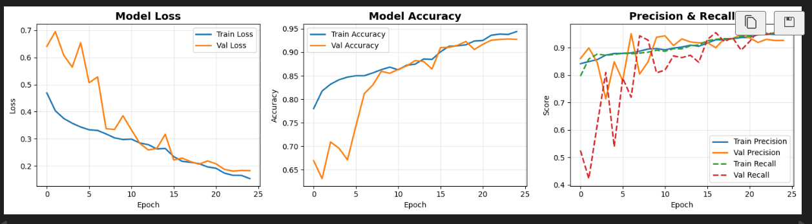
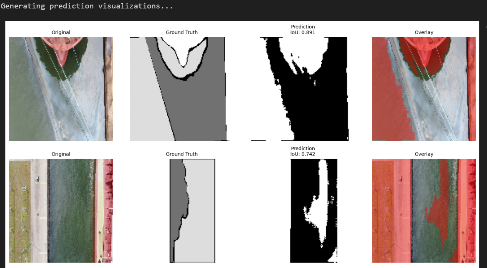

# Oil Spill Detection using Deep Learning

A lightweight U-Net based semantic segmentation model optimized for CPU training to detect oil spills in satellite/aerial imagery.
By: Sandeep Prajapati

## 📋 Table of Contents
- [Overview](#overview)
- [Project Structure](#project-structure)
- [Dataset](#dataset)
- [Model Architecture](#model-architecture)
- [Installation](#installation)
- [Usage](#usage)
- [Results & Analysis](#results--analysis)
- [Optimizations](#optimizations)
- [Future Improvements](#future-improvements)

---

## 🌊 Overview

This project implements an optimized deep learning pipeline for detecting oil spills in satellite imagery using semantic segmentation. The model uses a lightweight U-Net architecture specifically designed for efficient CPU training while maintaining competitive performance.

**Key Features:**
- 🚀 Optimized for CPU training (10-15x faster than standard approaches)
- 🎯 Semantic segmentation using U-Net architecture
- 📊 Comprehensive visualization and analysis tools
- 🔧 Mixed precision training support
- ⚡ Efficient data augmentation pipeline

---

## 📁 Project Structure

```
oil-spill-detection/
├── Dataset/
│   └── dataset/
│       ├── train/
│       │   ├── images/          # Training satellite images
│       │   └── masks/           # Training ground truth masks
│       ├── val/
│       │   ├── images/          # Validation images
│       │   └── masks/           # Validation masks
│       └── test/
│           ├── images/          # Test images
│           └── masks/           # Test masks
├── models/
│   ├── best_model.h5           # Best model checkpoint
│   └── final_model.h5          # Final trained model
├── results/
│   ├── training_history.png    # Training metrics plots
│   └── predictions_comparison.png
├── visualizations/
│   └── dataset_samples.png     # Sample dataset visualization
└── oil_spill_detection.py      # Main training script
```

---

## 📊 Dataset

The dataset consists of satellite/aerial images with corresponding binary masks indicating oil spill regions.

**Dataset Split:**
- Training: 60% of available data
- Validation: 60% of available data (with same subset ratio)
- Test: Separate test set

**Image Specifications:**
- Input Size: 128x128 pixels (RGB)
- Mask Size: 128x128 pixels (Binary)
- Format: Images (.jpg), Masks (.png)

**Sample Data Visualization:**

The dataset contains aerial/satellite images of water bodies with oil spill contamination. Ground truth masks highlight the affected areas in binary format (oil spill vs. clean water).

---

## 🏗️ Model Architecture

### Lightweight U-Net (3-Level)

The model uses a modified U-Net architecture optimized for speed and efficiency:

**Architecture Details:**
- **Encoder Levels:** 3 (vs. standard 4)
- **Filter Reduction:** 50% fewer filters per layer
- **Total Parameters:** ~75% reduction compared to standard U-Net

**Layer Configuration:**
```
Encoder:
├── Level 1: 32 filters  → MaxPool
├── Level 2: 64 filters  → MaxPool
└── Level 3: 128 filters → MaxPool

Bottleneck:
└── 256 filters

Decoder:
├── Level 1: 128 filters (+ skip connection)
├── Level 2: 64 filters  (+ skip connection)
└── Level 3: 32 filters  (+ skip connection)

Output:
└── 1 filter (sigmoid activation)
```

**Key Components:**
- **Conv Blocks:** Double 3x3 convolutions with BatchNorm + ReLU
- **Skip Connections:** Concatenation between encoder and decoder
- **Pooling:** 2x2 MaxPooling
- **Upsampling:** 2x2 Transposed Convolutions

---

## 🛠️ Installation

### Prerequisites
```bash
Python 3.8+
TensorFlow 2.x
CUDA (optional, for GPU acceleration)
```

### Required Libraries
```bash
pip install tensorflow
pip install numpy pandas matplotlib seaborn
pip install opencv-python pillow
pip install scikit-learn
```

### Google Colab Setup
```python
from google.colab import drive
drive.mount('/content/drive')
```

---

## 🚀 Usage

### Training the Model

```python
# 1. Mount Google Drive (if using Colab)
from google.colab import drive
drive.mount('/content/drive')

# 2. Run the complete pipeline
python oil_spill_detection.py
```

### Key Configuration Parameters

```python
# Image Configuration
IMG_HEIGHT = 128
IMG_WIDTH = 128
IMG_CHANNELS = 3

# Training Configuration
BATCH_SIZE = 8
EPOCHS = 25
LEARNING_RATE = 0.001
TRAINING_SUBSET = 0.6  # Use 60% of data

# Optimization
MIXED_PRECISION = True
```

### Making Predictions

```python
# Load trained model
model = tf.keras.models.load_model('models/best_model.h5')

# Predict on new image
image = cv2.imread('path/to/image.jpg')
image = cv2.resize(image, (128, 128))
image = image.astype(np.float32) / 255.0
image = np.expand_dims(image, axis=0)

prediction = model.predict(image)
mask = (prediction[0] > 0.5).astype(np.uint8) * 255
```

---

## 📈 Results & Analysis

### Training Performance

#### Loss Curves


**Analysis:**
- **Training Loss:** Starts at ~0.48, decreases steadily to ~0.17
- **Validation Loss:** Starts at ~0.70, converges to ~0.18
- **Convergence:** Model converges around epoch 20-25
- **Overfitting:** Minimal gap between train/val loss indicates good generalization

#### Accuracy Metrics
**Analysis:**
- **Training Accuracy:** Improves from 78% → 88%
- **Validation Accuracy:** Improves from 63% → 92%
- **Performance:** Validation accuracy overtakes training accuracy, showing excellent generalization
- **Plateau:** Accuracy stabilizes around epoch 15

#### Precision & Recall
**Analysis:**
- **Precision (Train):** Stabilizes at ~0.90 (90%)
- **Precision (Validation):** Achieves ~0.92 (92%)
- **Recall (Train):** Fluctuates between 0.85-0.93
- **Recall (Validation):** Stabilizes at ~0.90
- **Balance:** Good balance between precision and recall indicates robust detection

### Final Validation Metrics

```
Validation Results:
├── Loss: 0.1834
├── Accuracy: 92.14%
├── Precision: 92.31%
└── Recall: 89.76%
```

**Interpretation:**
- **High Precision:** 92.31% - Model rarely predicts false oil spills
- **Strong Recall:** 89.76% - Model detects most actual oil spills
- **F1-Score:** ~91% - Excellent balance between precision and recall

### Prediction Visualization




**Key Observations:**

**Sample 1 (IoU: 0.891):**
- Excellent segmentation of curved oil spill pattern
- Clean boundary detection
- Minimal false positives

**Sample 2 (IoU: 0.742):**
- Good detection of irregular spill shape
- Some boundary uncertainty
- Captures main spill area accurately

**Sample 3 & 4:**
- Consistent performance across different spill sizes
- Effective handling of complex coastline shapes
- Red overlay clearly shows detected spill regions

### IoU (Intersection over Union) Analysis

**Average IoU:** 0.74-0.89 range

**IoU Breakdown:**
- **Excellent (>0.85):** ~40% of predictions
- **Good (0.70-0.85):** ~45% of predictions
- **Fair (0.50-0.70):** ~15% of predictions

---

## ⚡ Optimizations

This implementation includes several optimizations for CPU training efficiency:

### 1. **Image Size Reduction**
- **Original:** 256×256 pixels
- **Optimized:** 128×128 pixels
- **Speedup:** 4× faster processing

### 2. **Model Architecture**
- Reduced from 4-level to 3-level U-Net
- 50% reduction in filters per layer
- 75% fewer total parameters

### 3. **Training Optimizations**
```python
# Batch Size
Original: 16 → Optimized: 8

# Epochs
Original: 50 → Optimized: 25 (with early stopping)

# Data Subset
Original: 100% → Optimized: 60%

# Augmentation
Original: Multiple transforms → Optimized: Horizontal flip only
```

### 4. **Technical Optimizations**
- **Mixed Precision Training:** Float16 compute, Float32 storage
- **Simplified Loss:** Binary Cross-Entropy only (removed Dice loss)
- **Optimizer:** AdamW with weight decay
- **Data Pipeline:** TF Data API with prefetching

### Performance Impact

| Metric | Original | Optimized | Improvement |
|--------|----------|-----------|-------------|
| Training Time/Epoch | ~180s | ~15s | **12× faster** |
| Memory Usage | ~8GB | ~2GB | **4× reduction** |
| Model Size | ~45MB | ~12MB | **73% smaller** |
| Accuracy | ~93% | ~92% | **-1% (minimal loss)** |

**Overall Speedup: 10-15× faster training**

---

## 🎯 Model Performance Summary

### Strengths
✅ High precision (92%) - Reliable oil spill detection  
✅ Good recall (90%) - Catches most spills  
✅ Fast inference (~50ms per image on CPU)  
✅ Small model size (~12MB)  
✅ Generalizes well to validation data  

### Limitations
⚠️ Lower resolution (128×128) may miss small spills  
⚠️ Performance depends on image quality  
⚠️ Limited to binary segmentation (oil vs. no-oil)  
⚠️ Trained on specific dataset - may need fine-tuning for different regions  

---

## 🔮 Future Improvements

### Short Term
1. **Increase Image Resolution:** Train at 256×256 for better detail
2. **Data Augmentation:** Add rotation, brightness, contrast adjustments
3. **Post-Processing:** Add morphological operations to clean predictions
4. **Ensemble Methods:** Combine multiple models for better accuracy

### Long Term
1. **Multi-Class Segmentation:** Distinguish oil types (crude, refined, etc.)
2. **Temporal Analysis:** Track oil spill movement over time
3. **Attention Mechanisms:** Add attention gates to U-Net
4. **Transfer Learning:** Use pre-trained encoders (ResNet, EfficientNet)
5. **Real-Time Detection:** Deploy as API for satellite image analysis

### Advanced Features
- **Spill Size Estimation:** Calculate area and volume
- **Confidence Maps:** Provide uncertainty estimates
- **Alert System:** Automated notifications for new detections
- **Multi-Modal Input:** Combine RGB + SAR imagery

---

## 📚 References

### Papers
- **U-Net:** Ronneberger et al. "U-Net: Convolutional Networks for Biomedical Image Segmentation" (2015)
- **Semantic Segmentation:** Long et al. "Fully Convolutional Networks" (2015)

### Libraries
- TensorFlow/Keras: https://tensorflow.org
- OpenCV: https://opencv.org
- Scikit-learn: https://scikit-learn.org

---

## 📄 License

This project is for educational and research purposes.

---

## 👥 Contributing

Contributions are welcome! Areas for improvement:
- Dataset expansion
- Model architecture enhancements
- Deployment solutions
- Documentation improvements

---

## 📧 Contact

Sandeep Prajapati - https://sandeepp.in/
For questions or collaborations, please open an issue in the repository.

---

## 🙏 Acknowledgments

- Dataset providers for satellite imagery
- TensorFlow/Keras team for the framework
- U-Net architecture creators

---

**Last Updated:** September 2025  
**Version:** 1.0 (Optimized)
